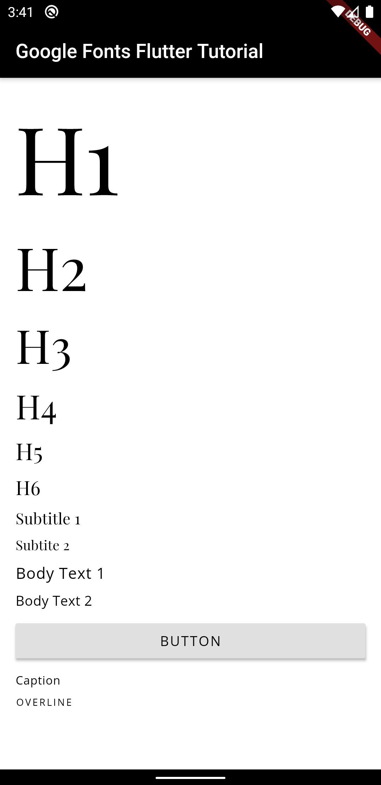

# Google Fonts Flutter Tutorial

This repo is for a YouTube tutorial I made on how to use Google Fonts and a custom text theme with Flutter. Check it out with the link below! 

[YouTube: How to use Google Fonts and Text Themes in Flutter](https://youtu.be/FRlVhsWaomk)
